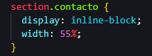
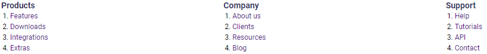
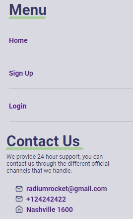

# Become a Software Professional by RADIUM ROCKET! 
## **Week-02**
The problem presented this week was to layout the HTML landing page of Trackgenix application. In order to do so, we were asked to build the corresponding sections and parent elements.
---
 **To achieve the solution**, *my first step* was dividing the project into sections, and asign a class to each one. This allowed my to organize my code, and
make it easier to be read.
I also add some images, to start the esthetic part of the landing page.
 
I found this markdown language very fun and super intuitive since we can make the README much more readable and understandable.

---
## **Week-03**
The problem of this week was to replicate with css the landing page that we made in Week 02 
---
**My solution** was to segment all the html and add different classes to it in order to style the styles correctly.
Work with relative positions and display:inline-block varying the width of the block:
  
  

Then for spaces between texts use margins and padding:  


I made a sidebar with a fixed position and that goes through the whole page.
This sidebar contains elements with hyperlinks:


And finally made a footer with the company's social networks

---
---

 ```
 Author:
 Nicolás Lalicata 
 ```
