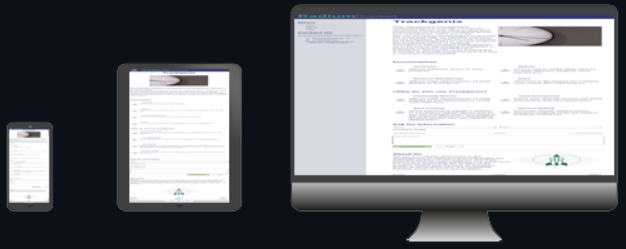

# Become a Software Professional by RADIUM ROCKET! 
## **Week-02**
The problem presented this week was to layout the HTML landing page of Trackgenix application. In order to do so, we were asked to build the corresponding sections and parent elements.
---
 **To achieve the solution**, *my first step* was dividing the project into sections, and asign a class to each one. This allowed my to organize my code, and
make it easier to be read.
I also add some images, to start the esthetic part of the landing page.
 
I found this markdown language very fun and super intuitive since we can make the README much more readable and understandable.

---
## **Week-03**
The problem of this week was to replicate with css the landing page that we made in Week 02 
---
**My solution** was to segment all the html and add different classes to it in order to style the styles correctly.
Work with relative positions and display:inline-block varying the width of the block:
  
  

Then for spaces between texts use margins and padding:  


I made a sidebar with a fixed position and that goes through the whole page.
This sidebar contains elements with hyperlinks:  


And finally made a footer with the company's social networks


---
## **Week-04**
The problem of week 04 proposed that we create a responsive web with the use of flexbox and mediaqueries
---
My solution was to **create containers** and **convert** them to flex blocks. With the correct properties the web becomes responsive without using too many mediaqueries  



---
## **Week-05**
This week the problem posed consisted of solving practical javascript exercises.
In my case, **I created 5 files** with a **.js extension** that contained the exercises solved and in order.
<ul>
  <li><em>01_variables_and_operators.js</li>
  <li>02_strings.js</li>
  <li>03_arrays.js</li>
  <li>04_if_else.js</li>
  <li>05_for.js</li>
  <li>06_functions.js
</em>
  </ul>

---
## **Week-06**
The problem this week was to create a login and a register form and validate their respective inputs with pure javascript.
Then we change the positioning and add new files to our original project in order to organize and structure the code in a clearer way.
In addition to that we create new CSS styles following our original layout for our **LOGIN** and **REGISTER** screens

---
## **Week-07**
This week's problem was validate our inputs **from the API** provided by Radium Rocket.
We were provided with a username and password to login and a series of validations for the signup part.


### **GitPage:**
```
 https://nicolaslalicata.github.io/BaSP-M2022-Etapa-1/Semana-07/views
 Author:
 Nicolás Lalicata 
 ```
